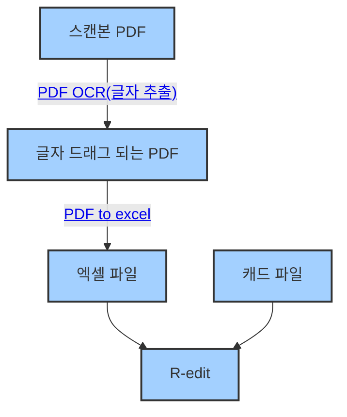

# 1단계: 캐드 파일에서 명판 문구 추출하여 파일 만들기

---



- **R-edit**을 거쳐 **DXF 파일**을 만들고, **Type3 프로그램**에서 **vnd 파일**(출력용 결과물)을 생성하여 **가공 담당자**에게 전달합니다.

---

## 📝 준비물
- 고객이 보낸 **발주서 PDF**
- **Excel(엑셀) 프로그램**

---

## PDF 종류 파악하기

PDF는 스캔본 PDF와 컴퓨터로 작성한 문서 PDF가 있습니다. 스캔본은 단순한 이미지이기 때문에 PDF 문서 안에 글자 정보가 없습니다. 컴퓨터로 작성한 PDF 문서는 실제로 PDF 안에 글자 정보가 있기 때문에 글자에 드래그가 됩니다. 드래그 여부로 PDF 종류를 간단히 체크할 수 있습니다.

### 스캔본 PDF 일 경우

1. [PDF OCR](https://www.ilovepdf.com/ko/ocr-pdf)을 해주는 홈페이지에 들어갑니다.

   

2. 글자를 추출하고자 하는 PDF 파일을 선택합니다.

   

3. OCR 옵션 화면입니다. 필요시 문서 언어를 한국어나 영어로 설정합니다.

   

4. OCR이 끝나면 **PDF 다운로드** 버튼을 눌러서 PDF 파일을 다운로드합니다.  
   다운로드 후 글자가 드래그 되는지 확인합니다.

   

---

### 글자 드래그 되는 PDF 일 경우

1. [PDF을 Excel로 변환](https://www.ilovepdf.com/ko/pdf_to_excel)해주는 홈페이지에 들어갑니다.

   

2. 엑셀로 변환하려는 PDF 파일을 선택합니다.

   

3. **OCR 없음** 기능이 무료입니다. **OCR 없음**을 선택합니다.  
   레이아웃은 원하는 것을 선택합니다.

   

4. **OCR 없이 계속**을 선택합니다. **OCR 적용**은 유료 기능입니다.

   

5. 변환이 끝나면 **EXCEL 다운로드** 버튼을 눌러서 엑셀 파일을 다운로드합니다.  

   

6. 변환이 완료된 엑셀 파일을 R-edit 프로그램에서 사용할 수 있는 형태로 직접 정리합니다.
   :::info
   ChatGPT 같은 AI한테 직접 정리해달라고 작성해도 됩니다.
   ```
   아래 원본 데이터를 다음과 같은 형태로 바꾸고 싶다. 엑셀에 붙여넣을 수 있도록 결과물을 만들어주세요.
   원하는 형태:
   텍스트1  텍스트2
   데이터1  데이터2

   원본 데이터:
   [엑셀 데이터를 전체 선택(ctrl+A) 후 복사해서 붙여넣기]
   ```
   :::

   

---

## ✅ 체크리스트
- [ ] OCR 이후 오타가 없는지 확인
- [ ] 똑같은 문구로 많은 수량을 요구한 사례가 있는지 확인

---