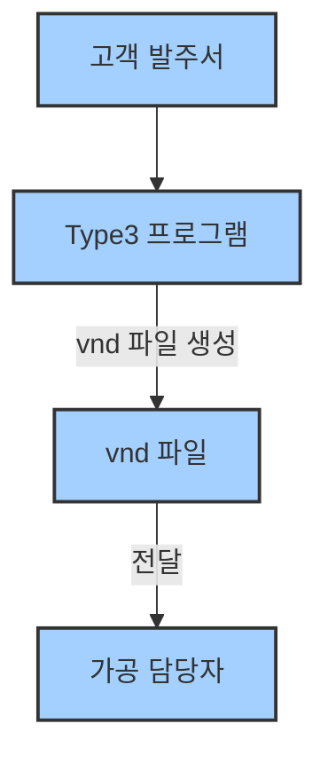
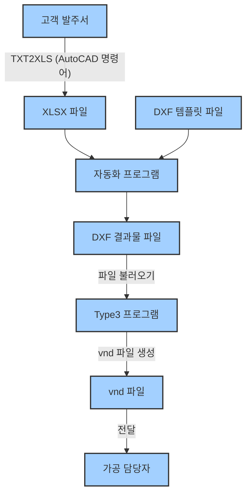

# 1단계: 고객 발주서에서 명판 문구 추출 및 XLSX 파일 만들기

---

## 🛠️ 작업 흐름 한눈에 보기

### 수량이 적을 때 (자동화 프로그램 없이 바로 작업)



- **Type3 프로그램**에서 바로 **vnd 파일**(출력용 결과물)을 만들고, 이 파일을 **가공 담당자**에게 전달합니다.

---

### 수량이 많을 때 (자동화 프로그램 활용)



- **자동화 프로그램**을 거쳐 **DXF 파일**을 만들고, **Type3 프로그램**에서 **vnd 파일**(출력용 결과물)을 생성하여 **가공 담당자**에게 전달합니다.

---

## 📝 준비물
- 고객이 보낸 **CAD(도면) 파일** 또는 **발주서(문서, 이미지 등)**
- **Excel(엑셀) 프로그램**
- **AutoCAD에 설치된 TXT2XLS LISP** (회사 PC에 기본 설치)

---

## 📋 TXT2XLS로 대량 텍스트 Excel로 옮기기 (추천)

1. **AutoCAD에서 고객 발주서(CAD 파일)를 엽니다.**
2. 명령어창에 `TXT2XLS`를 입력하고 실행합니다.
   - 엑셀 파일이 자동으로 열리고, 헤더가 자동으로 작성됩니다.
   - 헤더 아래 빈 셀에 커서가 자동으로 이동됩니다.
3. 명령어창에 `_fen`을 입력해 **Fence Select 모드**를 활성화합니다.
   - 이 모드를 사용하면, 드래그한 순서대로 텍스트가 엑셀에 붙여넣어집니다.
   - 그냥 드래그하면 순서가 섞일 수 있으니 꼭 `_fen`을 사용하세요.
4. **직선으로 텍스트를 올가미(드래그) 선택**합니다.
   - 정점을 클릭하며 직선으로, 엔터를 누르기 전까지 계속 선택 가능
   - 텍스트 사이 빈 공간을 지나가면 그 텍스트는 선택되지 않으니 주의
5. 선택이 끝나면 **엔터**를 누릅니다.
   - 백그라운드에서 열린 엑셀 파일에 텍스트가 자동으로 붙여넣어집니다.
6. 추가로 더 붙여넣기 하려면 TXT2XLS 명령을 다시 실행합니다.
   - 이미 엑셀 파일이 열려 있다면, 현재 선택된 셀 아래로 붙여넣어집니다.
   - 기존에 작업 중이던 엑셀 파일이 열려 있다면 주의하세요.

:::tip[팁]
- TXT2XLS는 TEXT, MTEXT 모두 복사할 수 있습니다.
- Fence Select 모드를 꼭 사용해야 순서가 맞게 붙여넣어집니다.
- 엑셀 파일은 자동으로 저장되지 않으니, 작업 후 꼭 저장하세요.
:::

---

## ⚡ 자동화 프로그램용 XLSX 파일 만들 때 주의사항
- 자동화 프로그램은 **문구만 1개의 열로 쭉 적혀 있으면 됨**
- 수량이 2개라면, 문구를 2번 적어야 함 (복사해서 한 줄씩 추가)
- 수량, 번호, 비고 등은 자동화 프로그램에서 사용하지 않음

:::info[Type3 호환성 주의]
- 텍스트에 **U, u**가 포함된 경우, Type3에서 도안 작업 시 문자 변환이 필요합니다.
- 특수문자, 한글 등은 가공 프로그램/Type3에서 깨질 수 있으니 가급적 피하세요.
- 자세한 변환 방법은 다음 단계에서 안내합니다.
:::

---

## ✅ 체크리스트
- [ ] 문구에 오타가 없는지 확인
- [ ] 수량이 많으면 문구를 여러 번 적었는지 확인

---

**이제 이 파일을 다음 단계(자동화 프로그램)에서 사용합니다.**


# 사전 준비사항

명판 자동화 프로그램을 사용하기 전에 필요한 파일과 환경을 준비해야 합니다.

## 📁 필요한 파일 준비

### DXF 템플릿 파일

AutoCAD에서 제작한 DXF 형식의 템플릿 파일이 필요합니다.

:::info[템플릿 파일 요구사항]
- **파일 형식**: DXF (AutoCAD 호환)
- **텍스트 요소**: TEXT/MTEXT 요소가 포함되어 있어야 함
- **텍스트 내용**: 임시 텍스트로 설정 (예: "TEXT", "SAMPLE")
- **레이어 구조**: 명확한 레이어 구조 권장
:::

#### 템플릿 제작 시 주의사항

:::warning[중요한 체크포인트]
- 텍스트 위치가 명확하게 정의되어 있어야 함
- 폰트와 크기가 적절히 설정되어 있어야 함
- 텍스트 영역이 명판 크기에 맞게 조정되어 있어야 함
:::

### Excel 텍스트 목록 파일

XLSX 형식의 Excel 파일에 텍스트 데이터를 준비해야 합니다.

:::info[Excel 파일 요구사항]
- **파일 형식**: XLSX (Excel 2007 이상)
- **헤더 행**: 첫 번째 행은 반드시 헤더(열 제목)로 설정
- **데이터 열**: 텍스트가 포함된 열이 있어야 함
- **데이터 완성도**: 빈 셀이 없도록 모든 행에 데이터 입력
:::

#### Excel 파일 예시

|  문구   | 
|--------|
| 텍스트 1 |
| 텍스트 2 |
| 텍스트 3 |
| 텍스트 4 |
| 텍스트 5 |

#### Excel 파일 작성 시 주의사항

:::tip[Excel 작성 팁]
- **헤더 설정**: 첫 번째 행은 반드시 헤더(열 제목)로 설정
- **열 구분**: 텍스트가 들어갈 열을 명확히 구분
- **데이터 완성**: 빈 셀이 없도록 모든 행에 데이터 입력
- **특수 문자**: 특수 문자 사용 시 호환성 확인
- **파일 크기**: 대용량 파일의 경우 처리 시간 고려
:::

## 🗂️ 폴더 구조 확인

프로그램 실행 전 폴더 구조를 확인하세요.

```
도안 생성 폴더/
└── output/            # 생성된 도면 DXF 결과 파일들
└── 프로그램 실행 파일
```

## 📋 체크리스트

프로그램 사용 전 다음 항목들을 확인하세요:

### 파일 준비
- [ ] DXF 템플릿 파일 준비 완료
- [ ] Excel 텍스트 목록 파일 준비 완료
- [ ] 템플릿 파일에 텍스트 요소 포함 확인
- [ ] Excel 파일 헤더 행 설정 확인

### 프로그램 설정
- [ ] 프로그램 실행 파일 위치 확인
- [ ] 템플릿 도안 폴더 경로 확인
- [ ] 결과물 폴더 (output/) 확인

## 🚨 주의사항

### 파일 관련 주의사항

:::danger[중요한 주의사항]
1. **파일 백업**: 작업 전 원본 파일 백업 권장
2. **파일 잠금**: Excel 파일이 다른 프로그램에서 열려있지 않은지 확인
3. **경로 길이**: 파일 경로가 너무 길지 않은지 확인
4. **특수 문자**: 파일명에 특수 문자 사용 자제
:::

### 프로그램 사용 주의사항

:::warning[사용 시 주의사항]
1. **메모리 사용량**: 대용량 파일 처리 시 메모리 사용량 모니터링
2. **처리 시간**: 대량 데이터 처리 시 충분한 시간 확보
3. **결과 확인**: 생성된 파일의 정확성 검증 필수
:::

## 📞 지원

준비 과정에서 문제가 발생하면 다음을 확인하세요:

:::info[도움말]
- [문제 해결 가이드](./troubleshooting.md)
- 담당자에게 문의
::: 

**다음 단계: 자동화 프로그램으로 명판 도안(DXF) 만들기에서 계속 진행하세요.**