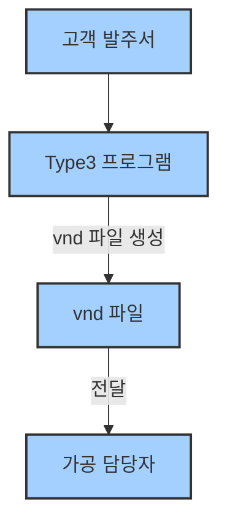
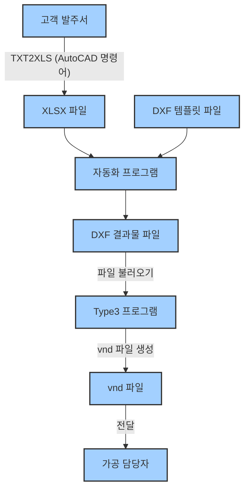

# 1단계: 고객 발주서에서 명판 문구 추출 및 XLSX 파일 만들기

---

## 🛠️ 작업 흐름 한눈에 보기

### 수량이 적을 때 (자동화 프로그램 없이 바로 작업)

- **Type3 프로그램**에서 바로 **vnd 파일**(출력용 결과물)을 만들고, 이 파일을 **가공 담당자**에게 전달합니다.

---

### 수량이 많을 때 (자동화 프로그램 활용)

- **자동화 프로그램**을 거쳐 **DXF 파일**을 만들고, **Type3 프로그램**에서 **vnd 파일**(출력용 결과물)을 생성하여 **가공 담당자**에게 전달합니다.

---

## 📝 준비물
- 고객이 보낸 **CAD(도면) 파일** 또는 **발주서(문서, 이미지 등)**
- **Excel(엑셀) 프로그램**
- **AutoCAD에 설치된 TXT2XLS LISP** (회사 PC에 기본 설치)

---

## 📋 TXT2XLS로 대량 텍스트 Excel로 옮기기 (추천)

:::info
TXT2XLS 명령어가 등록되어 있지 않다면 [AutoCAD LISP 자동 로드 설정](/docs/education/software/cad-software/autocad-lisp-setup)을 통해 명령어를 등록해주세요.
:::

1. **AutoCAD에서 고객 발주서(CAD 파일)를 엽니다.**

   5개 예시 문구들을 적어놨습니다.

   

2. 명령어창에 `TXT2XLS`를 입력하고 실행합니다.
      :::tip
      명령어 창에 직접 입력하지 않고 바로 명령어를 입력해도 됩니다.
      :::

      

   - 엑셀 파일이 자동으로 열리고, 헤더가 자동으로 작성됩니다.
   - 헤더 아래 빈 셀에 커서가 자동으로 이동됩니다.

      

   - `객체 선택:` 이라는 문구가 뜨면서 **객체 선택 단계**가 됩니다.

      

3. 명령어창에 `f`을 입력하고 **엔터**나 **스페이스바**를 눌러서 **Fence Select 모드**를 활성화합니다.
   - 이 모드를 사용하면, 드래그한 순서대로 텍스트가 엑셀에 붙여넣어집니다.

      :::warning
      그냥 드래그하면 글자 붙여넣기 할 때 순서가 섞일 수 있으니 꼭 **Fence Select 모드**을 사용하세요.
      :::

      

   - 모드를 활성화 하면 다음과 같이 됩니다.

      

4. **직선으로 텍스트를 올가미(드래그) 선택**합니다.
   - 마우스로 클릭하며 직선으로 글자를 선택합니다. 엔터를 눌러 **객체 선택 단계**를 끝내기 전까지 계속 선택 가능

      

   - 실수를 했다면 `U`를 입력하여 방금 클릭한 명령을 취소할 수 있습니다.

      :::danger
      텍스트 사이 빈 공간을 지나가면 그 텍스트는 선택되지 않으니 주의
      :::

      

   - 텍스트를 순서대로 모두 지나가며 선택해줍니다.

      

5. 선택이 끝나면 **엔터** 또는 **스페이스바**를 누릅니다. 

   - 그러면 **Fence Select 모드**가 끝나고 다시 **객체 선택 모드**로 돌아갑니다.

   - 모든 선택을 끝냈다면 다시 **엔터**나 **스페이스바**를 눌러 **객체 선택 모드**까지 끝냅니다.

      :::info
      추가로 더 선택해야 될 것이 있다면 다시 `f`를 입력하여 **Fence Select 모드**를 활성화 하면 됩니다.
      :::

      

   - 백그라운드에서 열린 엑셀 파일에 텍스트가 자동으로 붙여넣어집니다.

      

6. 추가로 더 붙여넣기 하려면 TXT2XLS 명령을 다시 실행합니다.
   
   - 이미 엑셀 파일이 열려 있다면, 

      

      현재 선택된 셀 위치에 붙여넣어집니다.

      

:::note[핵심 내용 정리]
- **TXT2XLS** 명령어는 TEXT, MTEXT 모두 복사할 수 있습니다.
- **Fence Select** 모드를 사용해야 순서에 맞게 붙여넣어집니다.
:::

7. 자동화 프로그램을 사용하기 위해 XLSX 파일 내용을 정리합니다.
- 자동화 프로그램은 **문구만 1개의 열로 쭉 적혀 있으면 됨**
- 수량이 2개라면, 문구를 2번 적어야 함 (복사해서 한 줄씩 추가)
- 명판 문구 외 수량, 번호, 비고 등은 자동화 프로그램에서 사용하지 않습니다.

   **예시)**

   

8. 수정이 완료된 XLSX 파일을 저장합니다.

   

---

## ✅ 체크리스트
- [ ] 문구에 오타가 없는지 확인
- [ ] 수량이 많으면 문구를 여러 번 적었는지 확인

---