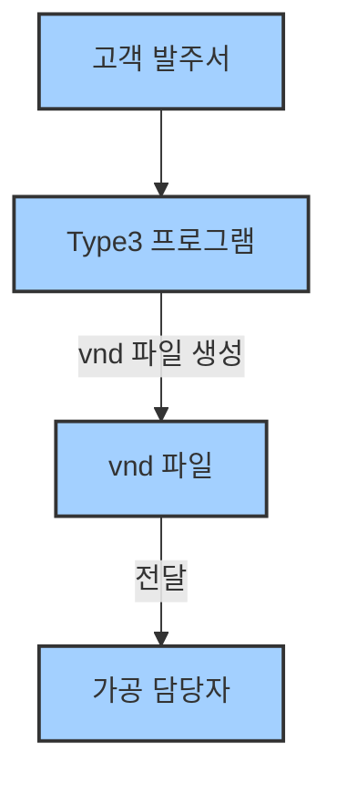
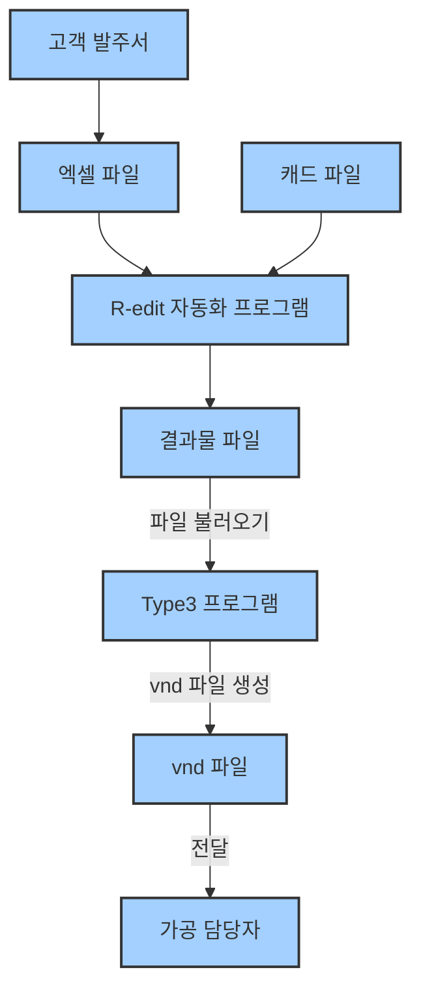

# 1단계: 캐드 파일에서 명판 문구 추출하여 파일 만들기

---

## 🛠️ 작업 흐름 한눈에 보기

### 수량이 적을 때 (자동화 프로그램 없이 바로 작업)

```mermaid
flowchart TD
    발주서[고객 발주서]-->Type3[Type3 프로그램]
    Type3-- vnd 파일 생성 -->vnd파일[vnd 파일]
    vnd파일-- 전달 -->가공담당자[가공 담당자]

    classDef main fill:#a3d0ff,stroke:#333,stroke-width:2px;
    class 발주서,Type3,vnd파일,가공담당자 main;
```

- **Type3 프로그램**에서 바로 **vnd 파일**(출력용 결과물)을 만들고, 이 파일을 **가공 담당자**에게 전달합니다.

---

### 수량이 많을 때 (자동화 프로그램 활용)

```mermaid
flowchart TD
    발주서[고객 발주서] -->XLSX파일[엑셀 파일]
    XLSX파일-->자동화프로그램[R-edit 자동화 프로그램]
    DXF템플릿파일[캐드 파일]-->자동화프로그램
    자동화프로그램-->DXF결과물파일[결과물 파일]
    DXF결과물파일-- 파일 불러오기 -->Type3[Type3 프로그램]
    Type3-- vnd 파일 생성 -->vnd파일[vnd 파일]
    vnd파일-- 전달 -->가공담당자[가공 담당자]

    classDef main fill:#a3d0ff,stroke:#333,stroke-width:2px;
    class 발주서,TXT2XLS,XLSX파일,자동화프로그램,DXF템플릿파일,DXF결과물파일,Type3,vnd파일,가공담당자 main;
```

- **R-edit**을 거쳐 **DXF 파일**을 만들고, **Type3 프로그램**에서 **vnd 파일**(출력용 결과물)을 생성하여 **가공 담당자**에게 전달합니다.

---