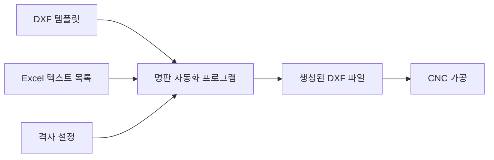

# 명판 자동화 프로그램 사용법

명판 자동화 프로그램의 기본 사용법을 단계별로 학습합니다. 프로그램을 처음 사용하는 분들을 위해 상세한 설명을 포함했습니다.

## 🎯 프로그램 소개

명판 자동화 프로그램은 DXF 템플릿과 Excel 텍스트 목록을 입력받아 CNC 가공용 명판 도면을 자동으로 생성하는 프로그램입니다.

### 주요 기능

:::tip[핵심 기능]
- ✅ **DXF 템플릿 처리**: 텍스트 위치, 폰트, 크기 자동 추출
- ✅ **Excel 데이터 처리**: XLSX 파일에서 텍스트 목록 자동 읽기
- ✅ **격자 배치**: 사용자 지정 행/열로 명판 자동 배치
- ✅ **텍스트 검증**: 템플릿 영역에 맞는 텍스트 길이 자동 검증
- ✅ **GUI 인터페이스**: 사용자 친화적인 그래픽 인터페이스
:::

### 작업 흐름

## 📋 사전 준비사항

프로그램 사용 전 필요한 파일과 환경을 준비해야 합니다.

:::info[필요한 파일]
- **DXF 템플릿 파일**: AutoCAD에서 제작한 DXF 형식 파일
- **Excel 텍스트 목록**: XLSX 형식의 텍스트 데이터 파일
:::

자세한 준비사항은 [사전 준비사항](./richwon-software-prepare.md)을 참조하세요.

## 🚀 기본 사용법

### 1단계: 프로그램 실행

프로그램을 실행하면 메인 화면이 나타납니다.

:::note[프로그램 실행]
프로그램 아이콘을 더블클릭하거나 시작 메뉴에서 실행하세요.
:::

### 2단계: 템플릿 파일 선택

1. **템플릿 선택** 영역에서 **"찾아보기"** 버튼을 클릭
2. 사용할 DXF 템플릿 파일을 선택
3. 선택된 파일 경로가 텍스트 박스에 표시

:::tip[템플릿 파일]
`templates/` 폴더에 미리 준비된 템플릿들이 있습니다.
:::

### 3단계: Excel 파일 선택

1. **텍스트 파일 선택** 영역에서 **"찾아보기"** 버튼을 클릭
2. 텍스트 목록이 포함된 XLSX 파일을 선택
3. **"텍스트 열"** 드롭다운에서 출력할 텍스트가 있는 열을 선택

:::warning[Excel 파일 주의사항]
- 첫 번째 행은 반드시 헤더(열 제목)로 설정해야 합니다
- 빈 셀이 없도록 모든 행에 데이터를 입력하세요
:::

### 4단계: 출력물 설정

| 설정 옵션 | 설명 | 권장 사용처 |
|-----------|------|-------------|
| **Type3 2009 호환 출력** | 특수한 DXF 형식 (기본값) | Type3 소프트웨어 사용 시 |
| **일반 DXF 출력** | AutoCAD 등에서 사용하는 표준 DXF 형식 | AutoCAD 사용 시 |

### 5단계: 격자 설정

- **행 수**: 세로로 배치할 명판 개수 (기본값: 3)
- **열 수**: 가로로 배치할 명판 개수 (기본값: 3)

:::tip[격자 설정 팁]
명판 간격은 자동으로 5mm로 설정됩니다.
필요한 명판 개수보다 약간 큰 격자를 설정하는 것이 좋습니다.
:::

### 6단계: 데이터 미리보기

1. **"미리보기"** 버튼을 클릭하여 Excel 파일이 정상적으로 로딩되었는지 확인
2. 총 텍스트 개수와 처음 10개 텍스트 목록이 표시됩니다

:::info[미리보기 확인사항]
- 총 텍스트 개수가 예상과 일치하는지 확인
- 텍스트 내용이 올바른지 확인
- 빈 셀이나 오류가 없는지 확인
:::

### 7단계: 명판 생성

1. 모든 설정이 완료되면 **"명판 생성"** 버튼을 클릭
2. 상태바에 진행 상황이 표시됩니다
3. 생성이 완료되면 `output/` 폴더에 DXF 파일이 생성됩니다

#### 출력 파일 정보

| 항목 | 설명 |
|------|------|
| **파일명** | `템플릿명_001_행x열_type3.dxf` 형식으로 자동 생성 |
| **저장 위치** | `output/` 폴더 |
| **파일 형식** | DXF (AutoCAD 호환) |

:::success[생성 완료]
명판 생성이 완료되면 상태바에 "생성 완료" 메시지가 표시됩니다.
생성된 파일을 확인하여 정상적으로 배치되었는지 검증하세요.
:::

## 📚 다음 단계

:::tip[학습 순서]
1. **[실습 예제](./richwon-software-examples.md)**: 실제 사용 예제와 단계별 가이드
2. **[문제 해결](./richwon-software-troubleshooting.md)**: 자주 발생하는 문제와 해결방법
3. **[사전 준비사항](./richwon-software-prepare.md)**: 상세한 파일 준비 가이드
:::
