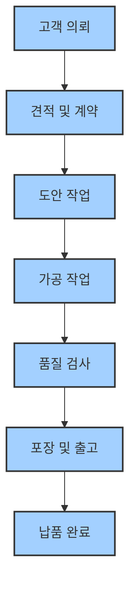

# 🏭 생산/업무 프로세스

리치원 컴퍼니의 명판 제작 전체 흐름과 각 단계별 작업 기준을 안내합니다.

---

## 📋 명판 제작 전체 흐름

---

## 🔄 단계별 상세 프로세스

### 1단계: 고객 의뢰 접수

| 항목 | 내용 |
|------|------|
| **담당자** | 사장님, 담당자 |
| **주요 작업** | 고객 요청 사항 파악, 도면/문서 확인 |
| **체크리스트** | - [ ] 제품 종류 및 수량 확인 - [ ] 납기일 확인 - [ ] 특별 요구사항 확인 - [ ] 견적 가능 여부 판단 |

:::tip[의뢰 접수 시 주의사항]
- 고객 요청사항을 정확히 파악하고 기록하세요.
- 납기일이 현실적인지 확인하세요.
- 특별한 요구사항이 있으면 반드시 메모하세요.
:::

### 2단계: 견적 및 계약

| 항목 | 내용 |
|------|------|
| **담당자** | 사장님 |
| **주요 작업** | 원가 계산, 견적서 작성, 계약 체결 |
| **체크리스트** | - [ ] 재료비 계산 - [ ] 공정비 계산 - [ ] 견적서 작성 - [ ] 고객 승인 확인 |

### 3단계: 도안 작업

| 항목 | 내용 |
|------|------|
| **담당자** | 도안 담당자 |
| **주요 작업** | 발주서 작성, Type3 도안, 자동화 프로그램 활용 |
| **체크리스트** | - [ ] 고객 발주서 확인 - [ ] Type3 도안 작성 - [ ] 도안 검토 |

:::info[도안 작업 팁]
- [명판 자동화 튜토리얼](../education/software/richwon-software/01-extract-text-to-excel.md)을 참고하세요.
- 도안 완료 후 반드시 검토를 거치세요.
:::

### 4단계: 가공 작업

| 항목 | 내용 |
|------|------|
| **담당자** | 가공 담당자 |
| **주요 작업** | CNC 가공, 레이저 마킹, 인쇄 등 |
| **체크리스트** | - [ ] 가공 장비 점검 - [ ] 재료 확인 - [ ] 가공 작업 수행 - [ ] 작업 중 품질 확인 |

### 5단계: 품질 검사 및 추가 작업

| 항목 | 내용 |
|------|------|
| **담당자** | 검사 담당자 |
| **주요 작업** | 치수, 품질, 외관 검사 |
| **체크리스트** | - [ ] 치수 정확성 확인 - [ ] 표면 품질 확인 - [ ] 문자/도안 정확성 확인 - [ ] 양면 테이프 부착 여부 |

### 6단계: 포장 및 출고

| 항목 | 내용 |
|------|------|
| **담당자** | 포장 담당자 |
| **주요 작업** | 포장, 출고 준비 |
| **체크리스트** | - [ ] 포장재 확인 - [ ] 포장 작업 - [ ] 명세서 - [ ] 배송 준비 |

---

## 📄 표준 양식

### 작업지시서 예시

| 항목 | 내용 |
|------|------|
| **작업 번호** | 2024-001 |
| **고객명** | ○○기업 |
| **제품명** | 알루미늄 명판 |
| **수량** | 100개 |
| **납기일** | 2024.01.15 |
| **특별 요구사항** | 양면테이프 처리 |

### 검사표 예시

| 검사 항목 | 기준 | 결과 | 비고 |
|-----------|------|------|------|
| 치수 | ±0.5mm | ○ | |
| 표면 품질 | 스크래치 없음 | ○ | |
| 문자 정확성 | 오타 없음 | ○ | |

---

## 📦 제품별 납품/포장 기준

### 알루미늄 명판

| 구분 | 기준 |
|------|------|
| **포장재** | 뽁뽁이, 포장 봉투, 골판지 박스 |
| **포장 방법** | 개별 포장 봉투 → 박스 포장 |
| **특별 주의** | 스크래치 방지 |

### 스테인리스 명판

| 구분 | 기준 |
|------|------|
| **포장재** | 뽁뽁이, 포장 봉투, 골판지 박스 |
| **포장 방법** | 개별 포장 봉투 → 박스 포장 |
| **특별 주의** | 지문 방지 |

### 아크릴 명판

| 구분 | 기준 |
|------|------|
| **포장재** | PE 봉투, 골판지 박스 |
| **포장 방법** | 뽁뽁이 → 박스 포장 |
| **특별 주의** | 스크래치, 지문 방지, 파손 방지 |

---

## ⚠️ 불량/클레임 처리 절차

### 불량 발견 시

1. **즉시 작업 중단**
2. **담당자에게 보고**
3. **불량 원인 분석**
4. **재작업 또는 수정 작업**

### 클레임 접수 시

1. **고객 요청사항 정확히 파악**
2. **사장님에게 보고**
3. **해결 방안 검토**
4. **고객과 협의 후 처리**

:::caution[클레임 처리 주의사항]
- 고객의 요청사항을 정확히 파악하세요.
- 즉시 담당자에게 보고하세요.
- 고객과의 소통을 중시하세요.
:::

---

## 📞 문의 및 지원

- **일반 문의**: 담당자에게 직접 문의
- **긴급 문의**: 사장님에게 직접 연락
- **기술 문의**: [교육 자료](../education/intro.md) 참고

---

:::info
프로세스는 지속적으로 개선됩니다. 
더 나은 방법이 있으면 언제든 제안해 주세요!
::: 